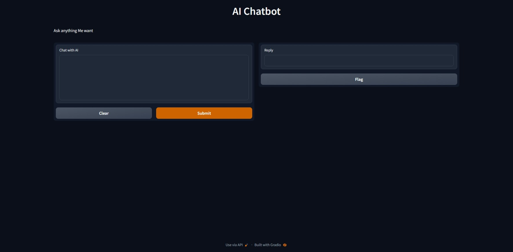

# AI Chatbot

This is a simple AI chatbot that uses OpenAI's GPT-3.5 model to generate responses to user input.

## Installation

To use the chatbot, you will need to install the following packages:

- `openai`
- `gradio`

You can install them using pip:

```
pip install openai gradio
```

## Screenshots



## Usage

To run the chatbot, simply run the `main.py` file:

```
python main.py
```

This will launch a Gradio interface that allows you to chat with the AI. You can ask the AI anything and it will generate a response based on the input.

## Configuration

To use the chatbot, you will need to provide your OpenAI API key. You can set this key by replacing the `openai.api_key` variable with your API key in the `main.py` file.

You can also customize the behavior of the chatbot by modifying the various parameters passed to the `openai.ChatCompletion.create()` method in the `chatbot()` function.

## Credits

This chatbot was developed using OpenAI's GPT-3.5 model, the Gradio library and Python.

## License

This code is licensed under the GNU General Public License Version 3, 29 June 2007. Feel free to use, modify, and distribute it in accordance with the terms of this license.
